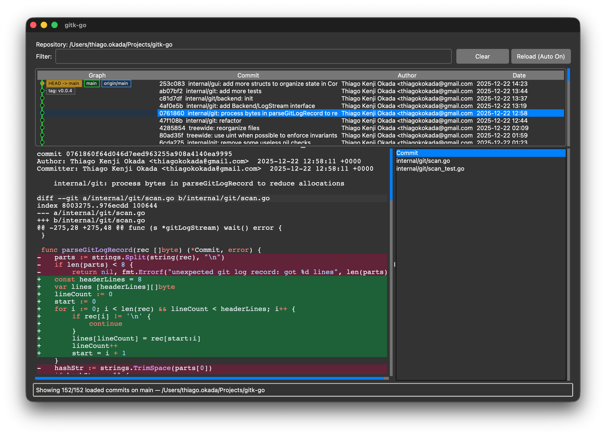

## gitk-go


`gitk-go` is a lightweight Git history explorer written in Go. It recreates much
of `gitk` using [`modernc.org/tk9.0`](https://pkg.go.dev/modernc.org/tk9.0) and
[`go-git`](https://github.com/go-git/go-git), and it can optionally leverage the
system `git` binary for faster local-change handling.



### Features

- Three-column commit list with branch graph, author, and date columns
- Background batching keeps the UI responsive and automatically loads more
- Diff viewer highlights additions, removals, headers, and supports per-file navigation plus optional syntax highlighting
- Built-in file list to jump to specific file diffs
- Keyboard shortcuts mirroring common gitk bindings (navigation, paging, reload)
- Optional acceleration using the system `git` CLI (see below)
- Automatic reload watcher (with UI toggle) to keep history fresh as the repository changes
- Auto-detects OS dark mode with optional manual override

### Usage

```bash
go run . [-limit N] [-mode auto|light|dark] /path/to/repo
```

Arguments:

- First positional argument (optional): repository root or `.git` directory (defaults to current directory)
- `-limit` (default `1000`): number of commits to load per batch
- `-mode` (default `auto`): choose light, dark, or auto-detected theme
- `-nowatch`: disable automatic reload when the repository changes (auto-reload is on by default)
- `-nosyntax`: disable syntax highlighting in the diff viewer
- `-verbose`: emit additional debug logging (fsnotify events, reload scheduling)
- `-version`: print the build version (plus active build tags when available) and exit. Version info comes from Go's build metadata (`go build -buildvcs` captures git revision automatically).

#### Build tags

`gitk-go` exposes a couple of build tags to tweak behavior when compiling:

- `gitcli`: Opt-in to using the system `git` binary for local-change detection and
  diff generation. This is recommended on very large repositories when `git` is
  available in `PATH`.
- `nosyntaxhighlight`: Disable syntax highlighting inside the diff viewer and fall
  back to the plain diff colors.

You can combine tags as needed, for example `go build -tags "gitcli,nosyntaxhighlight"`.

#### git CLI acceleration

By default, `gitk-go` uses pure Go code for repository access. For large
repositories you can opt-in to faster local-change detection and diff rendering
by building with the `gitcli` build tag:

```bash
go build -tags gitcli
```

This requires the `git` binary to be available in `$PATH`. If the binary is not
available the build will still succeed, but the accelerated paths will fail at
runtime, so only enable the tag when `git` is installed.

#### Garbage-collector experiment

If you are using Go 1.25 or newer, building or running with
`GOEXPERIMENT=greenteagc` can noticeably reduce UI pauses on very large
repositories:

```bash
GOEXPERIMENT=greenteagc go run .
```

This flag is optional and only affects performance characteristics; functionality
remains the same.

### Known issues

- Automatic reload doesn't work well with `core.fsmonitor` option from `git` enabled.
- Automatic reload doesn't detect untracked files since [fsmonitor doesn't support recursive watcher yet](https://github.com/fsnotify/fsnotify/issues/18)
- Light theme seems to be much slower than dark theme (not noticeable unless you're using a slow device)

### Development

```bash
go test ./...
go test -tags gitcli ./...
go build ./...
go build -tags gitcli ./...
```

Key packages:

- `cmd`: CLI parsing and entry point
- `internal/git`: repository access, commit scanning, graph building
- `internal/gui`: Tk UI and controller logic

See `AGENTS.md` for guidelines followed by the automation helping maintain this project.
