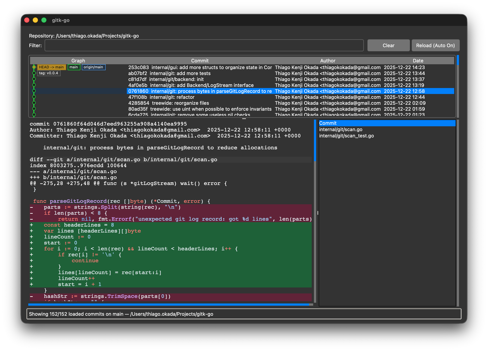

## gitk-go


`gitk-go` is a lightweight Git history explorer written in Go. It recreates
much of `gitk` using
[`modernc.org/tk9.0`](https://pkg.go.dev/modernc.org/tk9.0) and the system
`git` binary.



### Features

- Three-column commit list with branch graph, author, and date columns
- Background batching keeps the UI responsive and automatically loads more
  commits
- Diff viewer highlights additions, removals, headers, and supports per-file
  navigation plus optional syntax highlighting
- Built-in file list to jump to specific file diffs
- Keyboard shortcuts mirroring common `gitk` bindings (navigation, paging,
  reload). Press `F1` to see all shortcuts
- Automatic reload watcher (with UI toggle) to keep history fresh as the
  repository changes
- Light and dark color modes selected with `-mode` or `GITK_GO_MODE`

### Requirements

- Git version 2.23.0 or newer

### Usage

```console
$ gitk-go -h
Usage of gitk-go:
  -graph-cols uint
    	max number of graph columns to render (lower uses less CPU/memory) (default 200)
  -limit uint
    	number of commits to load per batch (larger uses more CPU/memory) (default 1000)
  -mode string
    	color mode: light or dark (default "dark")
  -nosyntax
    	disable syntax highlighting in the diff viewer
  -nowatch
    	disable automatic reload when repository changes
  -text-graph
    	render commit graph as text (disables canvas graph)
  -verbose
    	enable verbose logging
  -version
    	print version information and exit
```

### macOS release binaries

macOS may set the quarantine (security) attribute on downloaded release
binaries. If the app refuses to launch, clear it:

```console
xattr -d com.apple.quarantine /path/to/gitk-go
```

### Known issues

- Automatic reload doesn't work well with `core.fsmonitor` option from `git`
  enabled
- Light theme seems to be much slower than dark theme (not noticeable unless
  you're using a slow device)

### Development

```console
go test ./...
go build ./...
```

See `AGENTS.md` for guidelines followed by the automation helping maintain this
project.
